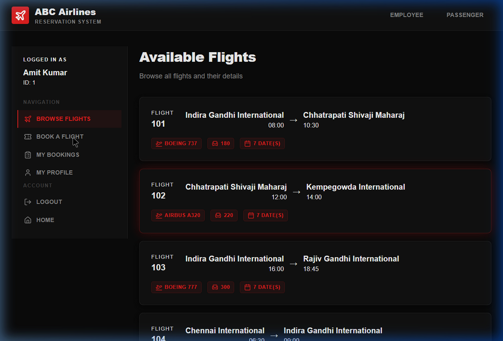
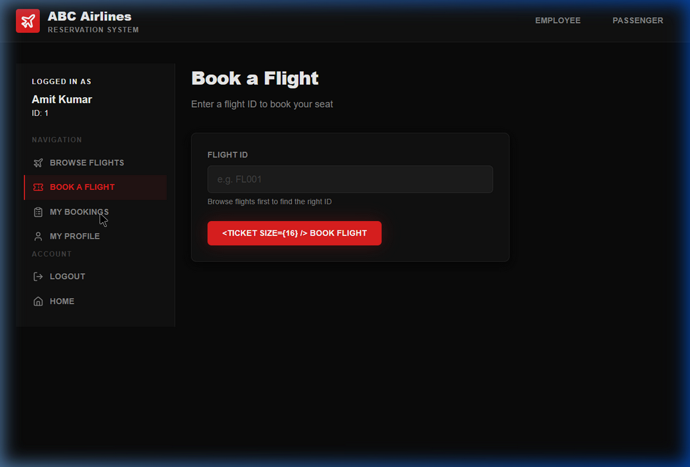
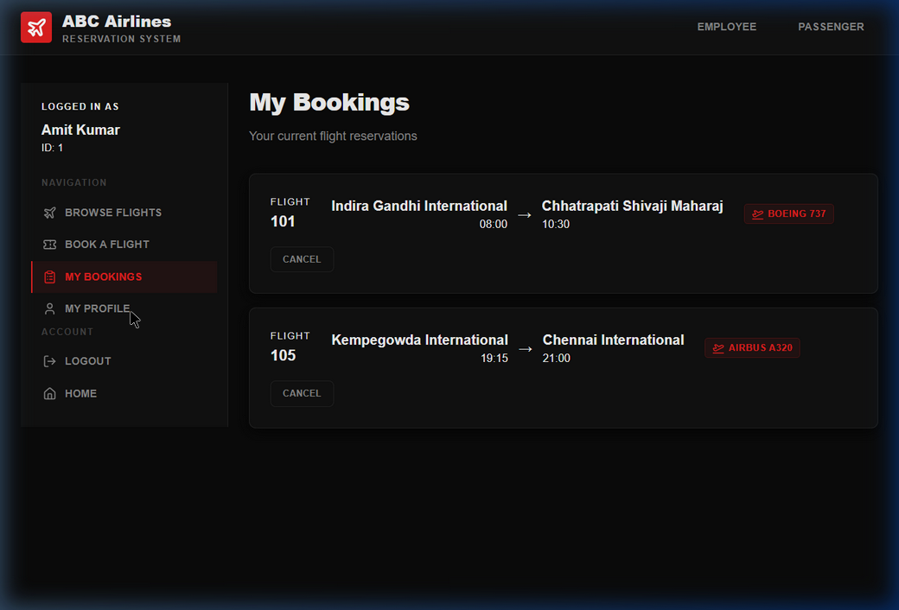
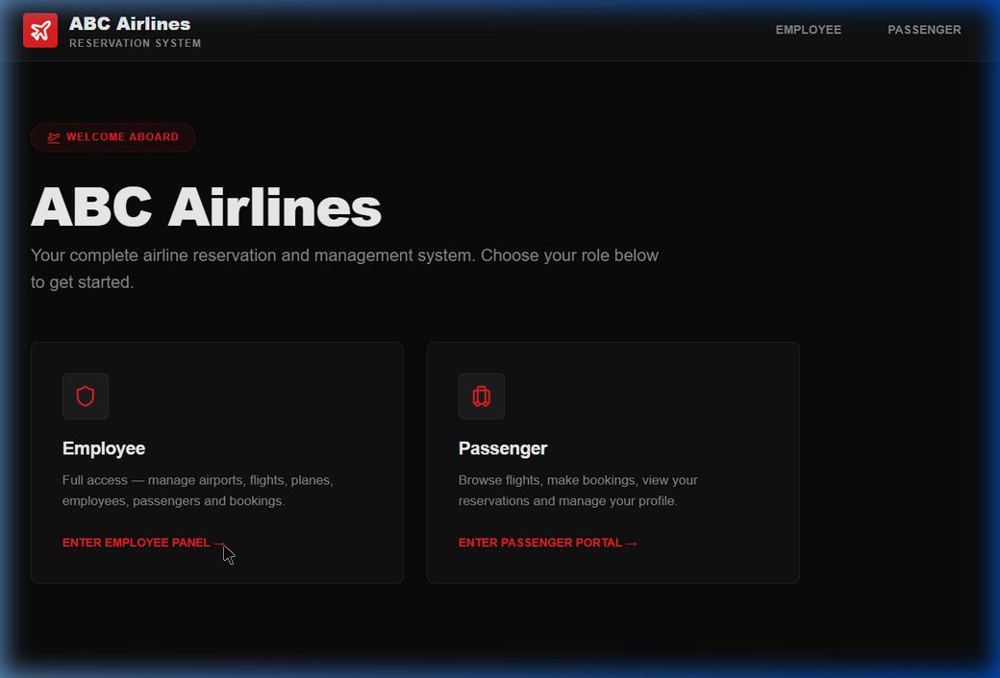
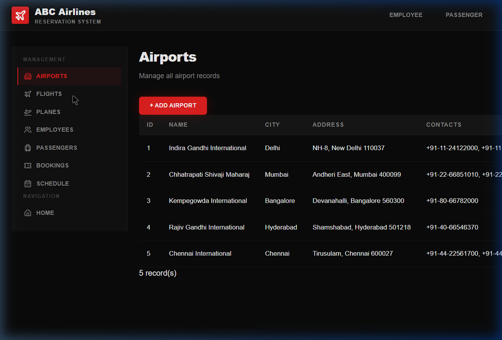
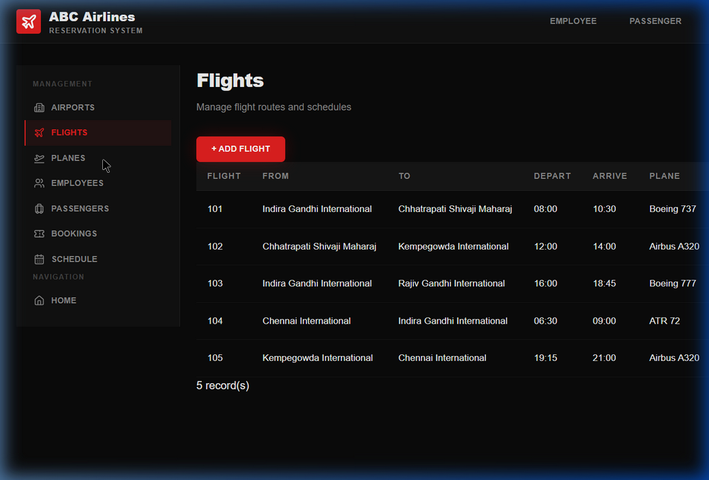
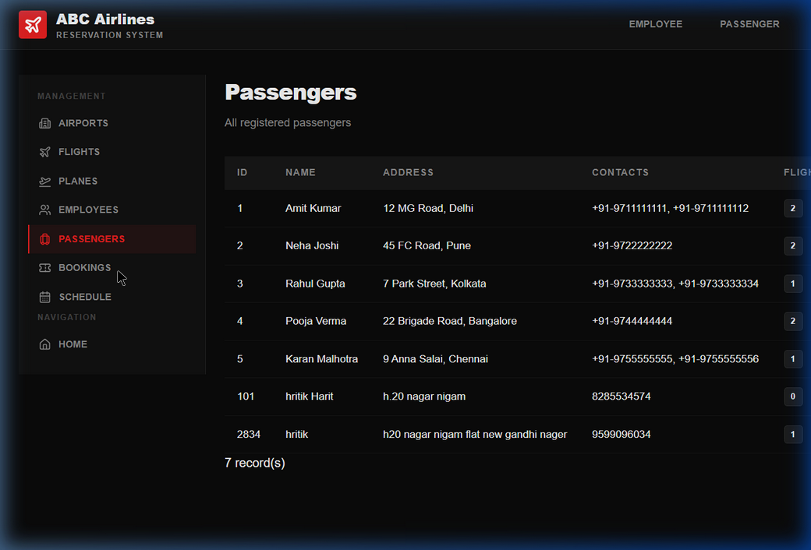

# ABC Airlines — Next.js Web App

Full-stack airline reservation system built with Next.js 14 (App Router) + PostgreSQL.

---

## Setup

### 1. Install dependencies
```bash
npm install
```

### 2. Configure your database
Copy the example env file and fill in your credentials:
```bash
cp .env.local.example .env.local
```

Open `.env.local` and set:
```
PG_HOST=localhost
PG_PORT=5432
PG_DATABASE=abc_airlines
PG_USER=postgres
PG_PASSWORD=your_actual_password_here
```

### 2a. Configure Google sign-in

Create a Google OAuth 2.0 Web Application client and add this authorized redirect URI for local development:

```
http://localhost:3000/api/auth/google/callback
```

Then add the following to `.env.local` (see `.env.local.example`):

```
GOOGLE_CLIENT_ID=your_google_client_id
GOOGLE_CLIENT_SECRET=your_google_client_secret
GOOGLE_CALLBACK_URL=http://localhost:3000/api/auth/google/callback
AUTH_SESSION_SECRET=a_unique_random_value_at_least_32_characters_long
```

Staff credentials for `/employee` are stored as a hashed password in Supabase/Postgres. On first run, the app creates that account from:

```
EMPLOYEE_USERNAME=admin
EMPLOYEE_PASSWORD=change_this_staff_password
```

For a deployed app, set `GOOGLE_CALLBACK_URL` and the authorized Google redirect URI to that deployment's exact HTTPS URL.

### 3. Make sure your database is ready
Run the SQL script from earlier (`abc_airlines_with_data.sql`) in pgAdmin or psql:
```bash
psql -U postgres -d abc_airlines -f abc_airlines_with_data.sql
```

### 4. Run the dev server
```bash
npm run dev
```

Open [http://localhost:3000](http://localhost:3000)

---

## Capabilities & Official Functionality Walkthrough

The platform is strategically divided into two secure, distinct experiences: the **Passenger Portal** for customers to discover and book flights, and the **Employee Dashboard** for airline staff to administer the entire operation.

### 🌟 1. Passenger Experience (User Portal) `/passenger`

The passenger side of the platform allows users to rapidly find and manage their travel.

* **Flight Discovery & Booking**: Passengers can browse active flights, view departure and arrival times, and immediately assign a flight to their account.
<p align="center">
  
</p>

* **Managing Reservations ("My Bookings")**: Functional view listing upcoming flights dynamically, giving the user immediate power to cancel reservations.
<p align="center">
  
</p>

* **Secure Profile Management**: Lets passengers quickly revise their personal data via intuitive forms.
<p align="center">
  
</p>

* **Google Sign-In**: Passengers sign in with Google through Passport. On a person's first Google sign-in, the app creates a passenger record and an automatically generated numeric passenger ID; later sign-ins reuse that same ID so their bookings remain attached to them. Google does not provide a phone number or mailing address, so the app then asks for those details and stores the address on `passenger` and the phone number on `passenger_contact`.


### 🛠️ 2. Employee Operations (Admin Dashboard) `/employee`

The administrative hub is locked behind a staff username and password. After sign-in, employees get unfettered, structured access to manage the core infrastructure.

* **Dashboard & Quick Analytics**: Main overview linking to all necessary database actions.
<p align="center">
  
</p>

* **Flights Management**: Staff can review routes, correct timings, block flights, and assign fleet variables.
<p align="center">
  
</p>

* **Fleet & Aircraft Allocation**: Database capturing plane models, capacities, and identifying plates.
<p align="center">
  
</p>

* **System-Wide Bookings & Audits**: Complete unfiltered view of all bookings linking specific passenger profiles to active flight IDs.
<p align="center">
  
</p>

* **Visual Walkthrough**: `[View End-to-end Session Video](./docs/screenshots/full_walkthrough.webp)`

---

## Project Structure

```
abc_airlines_nextjs/
├── app/
│   ├── page.js                    # Home — role selection
│   ├── layout.js                  # Root layout with nav
│   ├── globals.css
│   │
│   ├── employee/
│   │   ├── page.js                # Employee dashboard
│   │   ├── airports/page.js       # CRUD airports
│   │   ├── flights/page.js        # CRUD flights
│   │   ├── planes/page.js         # CRUD planes
│   │   ├── employees/page.js      # CRUD employees
│   │   ├── passengers/page.js     # View all passengers
│   │   ├── bookings/page.js       # View all bookings
│   │   └── schedule/page.js       # 7-day schedule
│   │
│   ├── passenger/
│   │   └── page.js                # Login/Register + browse/book/cancel
│   │
│   └── api/
│       ├── airports/route.js      # GET all, POST
│       ├── airports/[id]/route.js # PUT, DELETE
│       ├── flights/route.js       # GET all, POST
│       ├── flights/[id]/route.js  # GET one, PUT, DELETE
│       ├── planes/route.js        # GET all, POST
│       ├── planes/[id]/route.js   # PUT, DELETE
│       ├── employees/route.js     # GET all, POST
│       ├── employees/[id]/route.js# PUT, DELETE
│       ├── passengers/route.js    # GET all, POST
│       ├── passengers/[id]/route.js # GET one, PUT, DELETE
│       ├── bookings/route.js      # GET all, POST, DELETE
│       ├── schedule/route.js      # GET 7-day schedule
│       └── works-on/route.js      # POST, DELETE crew assignments
│
├── components/
│   └── ui.js                      # Shared components (Card, Table, Modal, Btn, Input, Toast)
│
├── lib/
│   └── db.js                      # PostgreSQL pool (singleton)
│
├── .env.local.example             # <- copy to .env.local and fill password
└── package.json
```

---

## API Reference

| Method | Endpoint | Description |
|--------|----------|-------------|
| GET | /api/airports | All airports with contacts |
| POST | /api/airports | Add airport |
| PUT | /api/airports/:id | Update airport |
| DELETE | /api/airports/:id | Delete airport |
| GET | /api/flights | All flights with stats |
| POST | /api/flights | Add flight |
| GET | /api/flights/:id | Flight detail + dates + crew |
| PUT | /api/flights/:id | Update flight |
| DELETE | /api/flights/:id | Delete flight + cascade |
| GET | /api/planes | All planes |
| POST | /api/planes | Add plane |
| PUT | /api/planes/:id | Update plane |
| DELETE | /api/planes/:id | Delete plane |
| GET | /api/employees | All employees |
| POST | /api/employees | Add employee |
| PUT | /api/employees/:id | Update employee |
| DELETE | /api/employees/:id | Delete + cascade |
| GET | /api/passengers | All passengers |
| POST | /api/passengers | Register passenger |
| GET | /api/passengers/:id | Profile + bookings |
| PUT | /api/passengers/:id | Update profile |
| DELETE | /api/passengers/:id | Delete + cascade |
| GET | /api/bookings | All bookings |
| POST | /api/bookings | Book a flight |
| DELETE | /api/bookings | Cancel booking |
| GET | /api/schedule | 7-day schedule |
| POST | /api/works-on | Assign employee to flight |
| DELETE | /api/works-on | Remove assignment |
